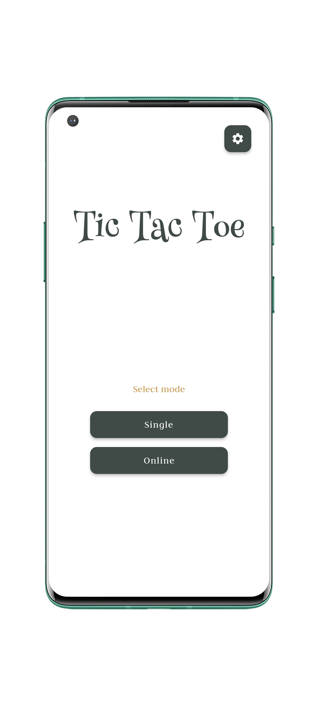
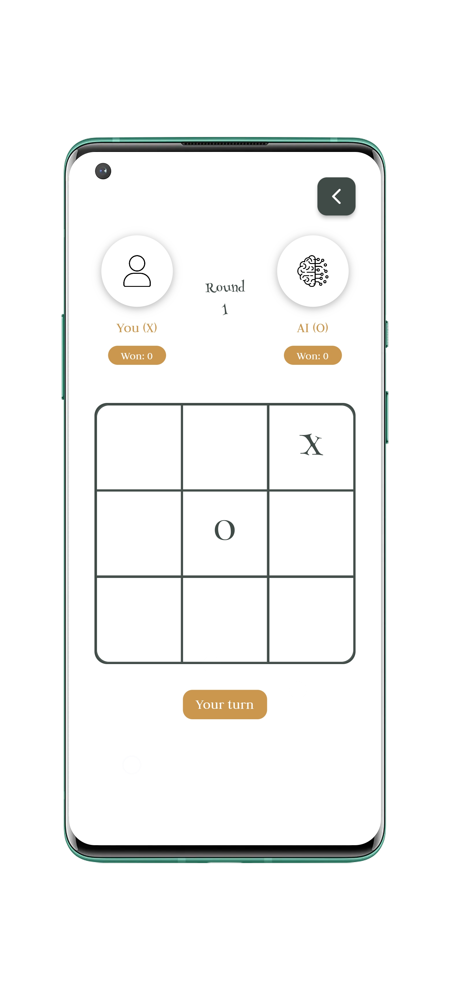
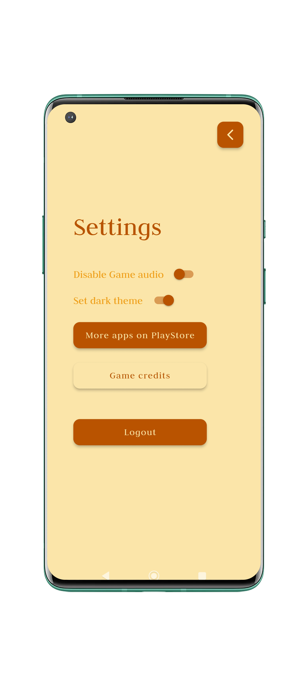

# Tic Tac Toe - Online 

A minimal twist on the classic game featuring both online and offline modes. Built with the power of **Flutter** and **Firebase**, this app runs seamlessly on **iOS**, **Android**, and **Web** platforms.

## Features

### 🔥 Online Multiplayer
- **2-Player Mode**: Play in real-time with a friend by creating a room.
- **Login Options**: Use **Google** or **Apple** authentication for a seamless login experience.
- **Firebase Real-Time Database**: Ensures smooth and instantaneous game updates.

### 🎮 Offline Modes
- **2-Player Local Mode**: Play offline with a friend on the same device.
- **AI Mode**: Challenge yourself against an AI opponent.

### 🕹️ Game Boards
- Multiple board sizes available:
  - **3x3** (Classic)
  - **4x4** (Intermediate)
  - **5x5** (Advanced)

### 🎨 Customization
- **UI Themes**: Choose between two themes to personalize your experience.
- **Minimal Design**: The app is designed with simplicity and ease of use in mind.

## Platforms
- [**Android**](https://play.google.com/store/apps/details?id=com.princeappstudio.tic_tac_toe)
- [**iOS**](https://apps.apple.com/us/app/tic-tac-toe-online-2player/id6740833110?platform=iphone)
- [**Web**](https://tictactoe.princeappstudio.in)
- [**F-Droid**](https://f-droid.org/en/packages/com.princeappstudio.tic_tac_toe/)

## Technologies Used
- **Flutter**: For building the cross-platform mobile and web application.
- **Firebase**: For real-time database and authentication.
  - **Firebase Authentication**: Supports Google and Apple login.
  - **Firebase Realtime Database**: Handles online gameplay.

## How to Play
### Online Mode
1. Log in using Google or Apple authentication.
2. Choose online mode and either join a room using the 6 digit code or create a room.
3. Start playing in real time and after each rounds the board size gets updated randomly.

### Offline Mode
1. Choose either **2-Player Local** or **AI Mode**.
2. Play with a friend on the same device or against AI.

## Installation
1. Clone this repository:
   ```bash
   git clone https://github.com/princesanjivy/tic-tac-toe.git
   ```
2. Navigate to the project directory:
   ```bash
   cd tic-tac-toe
   ```
3. Install dependencies:
   ```bash
   flutter pub get
   ```
4. Run the app:
   ```bash
   flutter run
   ```
5. You need to setup Firebase and need to generater the `firebase-options.dart`
6. For building the **F-Droid** version use `fdroid-submission` branch.

## Screenshots
### Home Screen


### Game Board


### Settings



## Roadmap
- [ ] Add support for more board sizes (e.g., 6x6, 7x7).
- [ ] Introduce leaderboards for online players.
- [ ] Add more theme options.

## Contributing
Contributions are welcome! Please follow these steps:
1. Fork the repository.
2. Create a new branch:
   ```bash
   git checkout -b feature-name
   ```
3. Make your changes and commit:
   ```bash
   git commit -m "Add feature name"
   ```
4. Push to your branch:
   ```bash
   git push origin feature-name
   ```
5. Submit a pull request.

Enjoy playing Tic Tac Toe and challenge your friends to see who's the ultimate champion!

